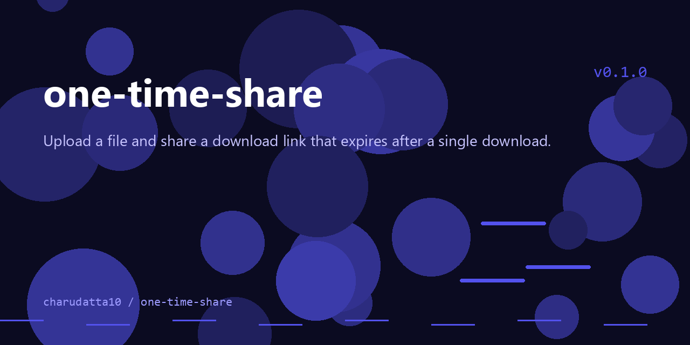

 
# OneTimeFileSharing

<p align="center">
  
</p>


One Time File Sharing — upload a file and share a download link that expires after a single download.


<!-- Badges: Project Status GitHub -->


[](https://github.com/sponsors/charudatta10)
[](https://charudatta10.github.io/LinkNet/)
[](https://charudatta10.github.io/myblog/)


<!-- Badges: Tools used -->
`python` `just` `flask` `sqlite3` 

## Documentation 🗎

## What is this?

A lightweight Flask web app for one-time file sharing. Files are uploaded and
encrypted, and the generated download link can only be used a single time
before the file is removed, keeping shared files private and ephemeral.

## Features 🌟

- Single Download File Sharing

## Getting Started 🌱

Install dependencies:

```sh
pip install -r requirements.txt
```

Run the server:

```sh
python run.py
```

The app listens on port 8080 by default.

## Usage

1. Register or log in at the web UI.
2. Upload a file through the upload page.
3. Share the generated single-download link with your recipient.

Run the tests:

```sh
python -m unittest discover -s tests
```

✨[Report a 🐛 or Request a ⭐](https://github.com/charudatta10/OneTimeFileSharing/issues)✨

## License

This project is licensed under the GPL-3.0 License. See the [LICENSE](LICENSE) file for details.

Copyright :copyright: 2024 CK :tm: @ charudatta10.   

<!-- Acknowledgment, References, Misc -->